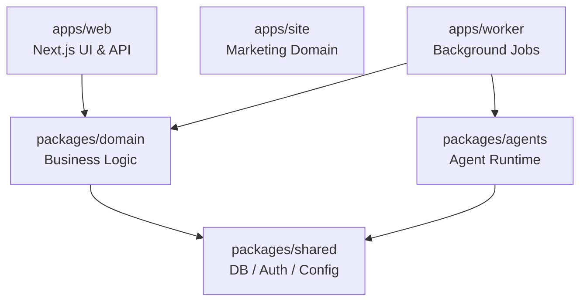

# Corgtex Platform

[](https://opensource.org/licenses/Apache-2.0)

Corgtex is an AI-native workspace operating system designed for self-managed organizations and progressive enterprises. It provides a unified environment combining governance, finance, and AI integration into a single platform.

## Features

- **Governance & Circles:** Model your organization using circles and roles rather than rigid hierarchies.
- **Proposals & Tensions:** Built-in asynchronous decision-making via consent-based proposals.
- **Organization Brain:** An AI-powered centralized knowledge base and wiki that your organization's members can query.
- **AI Agents:** Integrated AI agents grounded in your organizational data (Slack bot, embedded chat).
- **Finance Module:** Off-chain ledger tracking, spend requests, allocations, and approval flows.
- **Multi-Tenant Ready:** Native support for multiple isolated workspaces in the same deployment.

## Architecture



- **Framework:** Next.js 15 (App Router), React 19, Tailwind CSS 3
- **Database:** PostgreSQL via Prisma
- **Background Jobs:** Dedicated worker process using transactional outbox pattern
- **AI Providers:** Neutral model abstractions (OpenRouter/OpenAI-compatible)

## Quick Start (Self-Hosting)

You can spin up a fully operational Corgtex instance with sample data in a few minutes using Docker Compose.

1. Clone the repository:
```bash
git clone https://github.com/corgtex/corgtex.git
cd corgtex
```

2. Start the stack (Postgres + Web + Worker):
```bash
docker compose -f docker-compose.selfhost.yml up -d
```

3. Visit `http://localhost:3000` to access your new workspace. The default seed provisions an example workspace.

## Configuration Reference

Required environment variables for the core application (usually set in `.env` or your deployment platform):

| Variable | Description |
|---|---|
| `DATABASE_URL` | PostgreSQL connection string |
| `APP_URL` | Base URL of the deployed web application (e.g. `https://app.corgtex.com`) |
| `SESSION_COOKIE_SECRET` | 32+ character random string for signing secure cookies |
| `ADMIN_EMAIL` | Email for the initial bootstrap admin user |
| `ADMIN_PASSWORD` | Password for the initial bootstrap admin user |
| `WORKSPACE_NAME` | Display name of the initial workspace |
| `WORKSPACE_SLUG` | URL slug identifier for the workspace |

**Model Provider Settings (Optional but recommended):**
- `MODEL_PROVIDER`: Set to `openrouter` or `openai`
- `MODEL_API_KEY`: Your API key
- `MODEL_CHAT_DEFAULT`: e.g., `qwen/qwen3-32b`
- `MODEL_CHAT_CONVERSATION`: e.g., `google/gemini-2.5-flash` (used for interactive chat)
- `MODEL_EMBEDDING_DEFAULT`: e.g., `google/gemini-embedding-001`

## Enterprise Deployment (Configuration Repo Pattern)

For enterprises requiring total data isolation or specific seeded configurations, Corgtex is designed to be consumed via a thin wrapper repository.

Instead of forking this platform, you can create a private Configuration Repo (`corgtex/deploy-acmecorp`) containing only your custom `SEEDDATA/` and `seed-script.mjs`. Your Dockerfile can build from the `corgtex/corgtex` source by setting the `SEED_SCRIPTS=scripts/seed-acme.mjs` environment variable to override the default SaaS sample seeds.

See the [Configuration Repo Template docs](CONTRIBUTING.md) for more details.

## Contributing

We welcome community contributions! Please see our [Contributing Guide](CONTRIBUTING.md) for instructions on local development setup, PR expectations, and code style.

## License

Apache License 2.0. See [LICENSE](LICENSE) for details.
