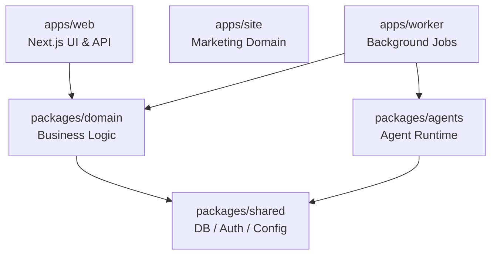

Corgtex is built as an enterprise-grade monorepo using Next.js, React, TypeScript, and Prisma. The architecture strictly separates business logic from presentation, and request-response cycles from heavy background processing.

## The runtime split

Corgtex divides its execution into two main applications (inside `apps/`):

1. **`apps/web` (Next.js)**: Serves the user interface and API routes. Handles all synchronous user requests, Next.js App Router rendering, and immediate data mutations.
2. **`apps/worker` (Node.js daemon)**: Runs the background workflows using a transactional outbox pattern. This isolated worker prevents long-running AI agent tasks or complex document ingestions from blocking the web server.

## Packages

The core logic resides in `packages/`. This allows both the Web app and Worker app to safely share implementations.

*   **`@corgtex/shared`**: Database generation via Prisma, centralized environment variable parsing, authentication types, and standard errors. Let's keep the lowest-level generic dependencies here.
*   **`@corgtex/domain`**: The beating heart of the platform. All business logic—governance policies, finance approvals, and core access control—lives here, totally agnostic to Next.js or the worker implementation.
*   **`@corgtex/agents`**: The orchestration and runtime for AI agents. Holds the logic for taking a task, fetching tools, and querying the LLM loop.
*   **`@corgtex/knowledge`**: Manages the Organization Brain. Handles ingestion, OCR, chunking, semantic matching, embeddings, and interacting with `pgvector`.
*   **`@corgtex/models`**: A neutral gateway layer for LLM providers (OpenAI, OpenRouter, etc.). Keeps the rest of the application decoupled from specific vendor SDKs.
*   **`@corgtex/workflows`**: The event and job orchestration system. Defines the event bus boundaries and job scheduling patterns used primarily by `apps/worker`.
*   **`@corgtex/connectors-sql`**: Specialized connectors for ingesting relational databases (e.g., PostgreSQL remote replicas) directly into the knowledge graph.
*   **`@corgtex/storage`**: File abstraction layer for handling standard uploads (local disk for dev, S3 for cloud).

## Tech Stack

*   **Framework**: Next.js 15 (App Router), React 19
*   **Language**: TypeScript (strict mode)
*   **Styling**: Tailwind CSS 3
*   **Database**: PostgreSQL
*   **ORM**: Prisma
*   **Vector Search**: `pgvector`
