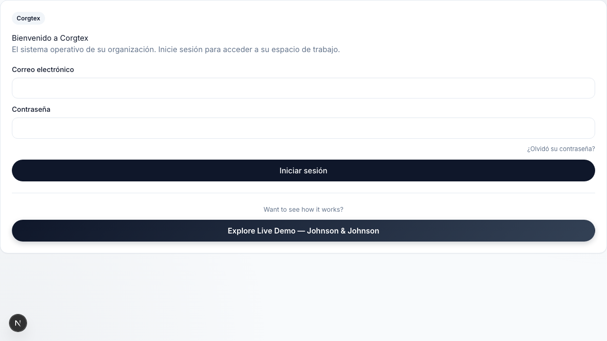

Completes the phase 2 i18n migration for the platform. 

This fully localizes the remaining core modules (Admin, Finance, Governance, Operator, Circles, Cycles, Leads, Actions, Meetings, Tensions, Proposals, Chat, Agents, Brain) to ensure 100% string parity between English and Spanish using `next-intl`.

### Acceptance Criteria

- [x] All remaining pages in `apps/web/app/[locale]/workspaces/[workspaceId]/**` use `next-intl`
- [x] No hardcoded UI strings remain in the touched files
- [x] All keys in `en.json` and `es.json` sync perfectly
- [x] CI is fully green (TypeScript, ESLint)

Plan: [docs/plans/feat-i18n-phase2.md](docs/plans/feat-i18n-phase2.md)
Visual Proof: 
