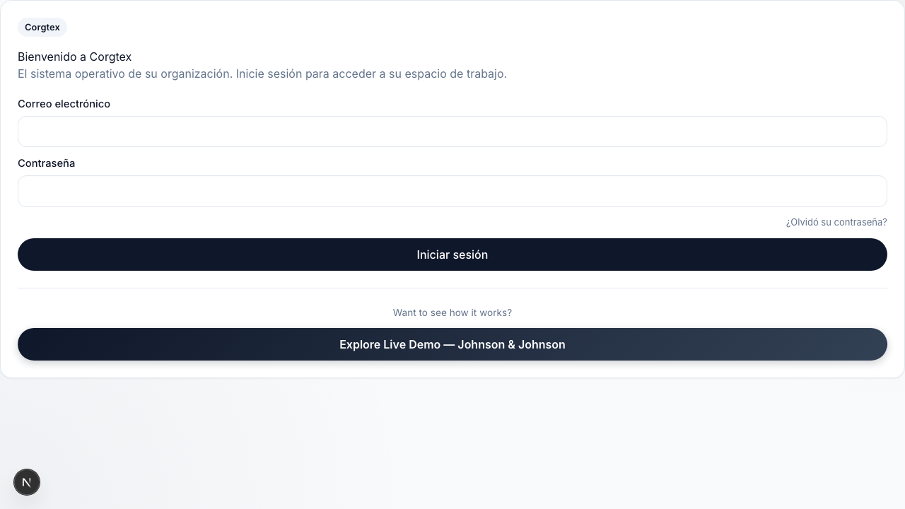

Completed translation extraction for workspace core pages and auth forms.

Closes PR 2 plan.

Acceptance criteria:
- [x] All auth form components use `useTranslations()` — zero hardcoded English in auth pages
- [x] All visible text in workspace layout uses `t()`
- [x] Dashboard page uses `t()` for all visible strings
- [x] ICU pluralization used for count-dependent text
- [x] Date formatting uses `next-intl` formatter
- [x] Goals, Members, Brain index pages fully translated
- [x] `messages/en.json` and `messages/es.json` updated with all new keys
- [x] `npm run check` passes

See plan: [feat-i18n-workspace-core.md](docs/plans/feat-i18n-workspace-core.md)

Visual proof:

